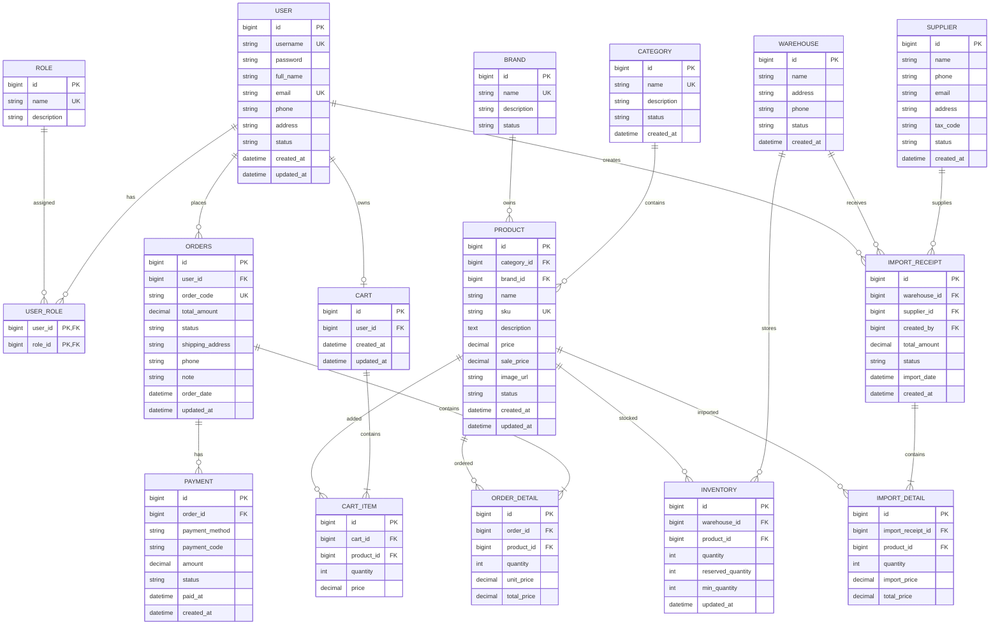
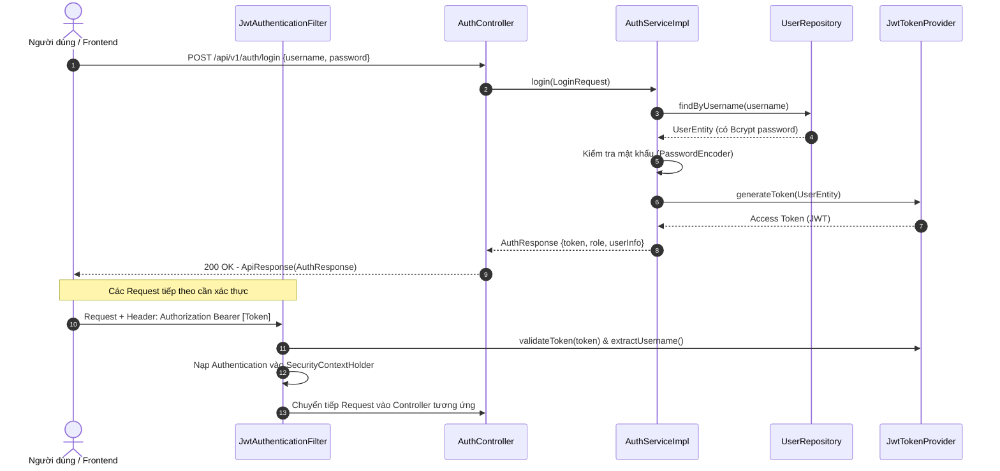
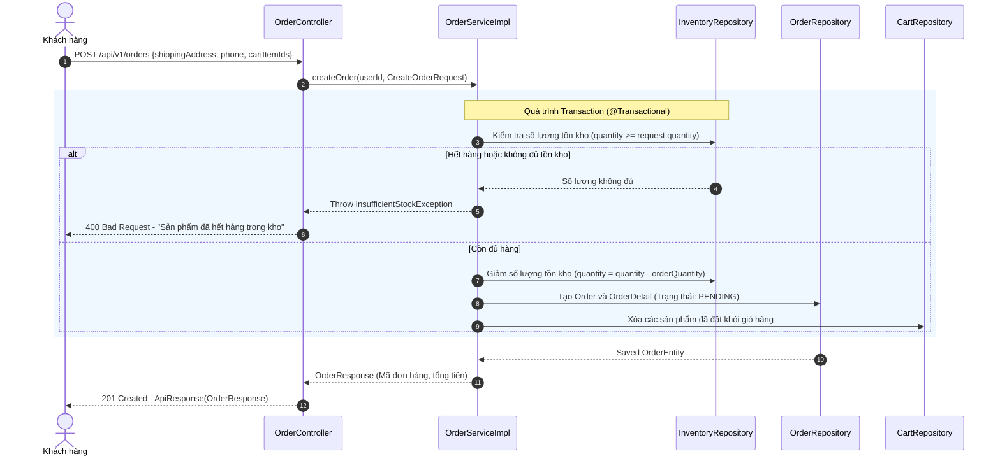

<!-- markdownlint-disable MD013 -->
# KẾ HOẠCH PHÁT TRIỂN VÀ ĐẶC TẢ KIẾN TRÚC HỆ THỐNG QUẢN LÝ BÁN HÀNG

Tài liệu kế hoạch phát triển và đặc tả kiến trúc phân tầng (Layered Architecture Specification) cho hệ thống Sales Management System.

---

## 1. TỔNG QUAN DỰ ÁN (PROJECT OVERVIEW)

Hệ thống **Sales Management System** là một ứng dụng quản lý bán hàng đa phân hệ, cung cấp giải pháp toàn diện từ khâu quản lý danh mục sản phẩm, quản lý kho bãi, xuất - nhập kho, đặt hàng, xử lý thanh toán cho đến quản trị người dùng và thống kê báo cáo doanh thu.

### 1.1. Các nhóm tác nhân (Actors)

1. **Quản trị viên (Admin):** Quản lý toàn bộ hệ thống, người dùng, phân quyền, sản phẩm, chương trình khuyến mãi, cấu hình hệ thống và theo dõi báo cáo doanh thu/thống kê.
2. **Khách hàng (Customer):** Đăng ký/đăng nhập, tìm kiếm & xem thông tin sản phẩm, quản lý giỏ hàng cá nhân, tiến hành đặt hàng, thanh toán và tra cứu lịch sử đơn hàng.
3. **Nhân viên kho (Warehouse Staff):** Tiếp nhận hàng từ nhà cung cấp, lập phiếu nhập/xuất kho, cập nhật số lượng tồn kho định kỳ và đối soát với nhà cung cấp.

---

## 2. CÔNG NGHỆ & MÔI TRƯỜNG PHÁT TRIỂN (TECH STACK)

Cấu hình dự án được đồng bộ chính xác với tệp [pom.xml](file:///d:/Sales-Management-N6TT27/sale-management/pom.xml) và [application.properties](file:///d:/Sales-Management-N6TT27/sale-management/src/main/resources/application.properties):

| Phân hệ / Thư viện | Phiên bản / Công nghệ | Vai trò trong hệ thống |
| :--- | :--- | :--- |
| **Java Platform** | **Java 21 (LTS)** | Ngôn ngữ lập trình chính, tận dụng các tính năng mới (Records, Pattern Matching, Virtual Threads nếu cần) |
| **Framework** | **Spring Boot 4.1.x / 3.x** | Khung nền tảng phát triển ứng dụng Backend |
| **RESTful Web API** | `spring-boot-starter-webmvc` | Xây dựng bộ điều khiển REST Controller, tiếp nhận và phản hồi JSON |
| **Data Persistence** | `spring-boot-starter-data-jpa` | Hibernate ORM, quản lý ánh xạ quan hệ thực thể (ORM) và Repository Pattern |
| **Security & Auth** | `spring-boot-starter-security` | Bảo mật hệ thống, cấu hình SecurityFilterChain, phân quyền theo Role |
| **Token Authentication** | `io.jsonwebtoken:jjwt-api:0.11.5` | Cơ chế xác thực phi trạng thái (Stateless Authentication) qua JWT Access Token |
| **Data Validation** | `spring-boot-starter-validation` | Kiểm tra tính hợp lệ của dữ liệu đầu vào (Jakarta Bean Validation `@Valid`, `@NotBlank`, ...) |
| **Database** | **MySQL 8.x** (`mysql-connector-j`) | Cơ sở dữ liệu quan hệ (Database: `sale_management`) |
| **Boilerplate Helper** | `org.projectlombok:lombok` | Giảm tải code Getter/Setter/Builder/Constructor |
| **Frontend Tích Hợp** | React / Next.js / Vue (SPA) | Kết nối Backend thông qua RESTful API chuẩn hóa |

---

## 3. CẤU TRÚC THƯ MỤC THỰC TẾ & KIẾN TRÚC PHÂN TẦNG (LAYERED ARCHITECTURE)

Dự án áp dụng mô hình **Kiến trúc phân tầng (Layered Architecture)** chuẩn doanh nghiệp, nằm trong thư mục gốc `sale-management/` với package cơ sở: `com.salemanagement`.

### 3.1. Sơ đồ cây thư mục mã nguồn

```text
d:\Sales-Management-N6TT27\
│
├── plan.md                                 # Kế hoạch phát triển & đặc tả kiến trúc hệ thống
│
└── sale-management/                        # Thư mục mã nguồn Spring Boot Project
    ├── pom.xml                             # Quản lý phụ thuộc Maven
    ├── mvnw / mvnw.cmd                     # Maven Wrapper
    │
    └── src/
        ├── main/
        │   ├── resources/
        │   │   ├── application.properties  # Cấu hình DataSource MySQL, JPA, Server Port
        │   │   └── static / templates      # Tài nguyên tĩnh (nếu có)
        │   │
        │   └── java/com/salemanagement/
        │       ├── SaleManagementApplication.java  # Main Application Entry Point
        │       │
        │       ├── config/                 # Cấu hình Spring (Security, JWT Filter, CORS, WebMvc, Swagger)
        │       ├── constant/               # Hằng số hệ thống, Enums (Role, OrderStatus, PaymentStatus)
        │       ├── controller/             # Tầng Presentation tiếp nhận HTTP request, trả về ApiResponse
        │       ├── dto/                    # Data Transfer Objects (Request / Response payloads)
        │       ├── entity/                 # Tầng JPA Entities ánh xạ trực tiếp tới các bảng MySQL
        │       ├── exception/              # Xử lý ngoại lệ tập trung (GlobalExceptionHandler, CustomException)
        │       ├── mapper/                 # Ánh xạ chuyển đổi giữa Entity <-> DTO (MapStruct hoặc thủ công)
        │       ├── repository/             # Tầng Data Access Layer kế thừa JpaRepository / JpaSpecification
        │       ├── service/                # Khai báo Interface các nghiệp vụ lõi (Business Logic)
        │       │   └── impl/               # Lớp triển khai cụ thể của Interface Service (@Service)
        │       ├── utils/                  # Các hàm tiện ích dùng chung (DateTime, String, SecurityContextUtil)
        │       └── validate/               # Custom Annotation Validator & Business Rule Validators
        │
        └── test/java/com/salemanagement/   # Unit test và Integration test các tầng
```

### 3.2. Bảng phân công trách nhiệm chi tiết của từng Package

| Tên Package | Trách nhiệm chính | Các lớp tiêu biểu dự kiến |
| :--- | :--- | :--- |
| `com.salemanagement.config` | Thiết lập bảo mật, CORS, Filter chuỗi xác thực JWT, cấu hình ModelMapper/Jackson, OpenAPI/Swagger. | `SecurityConfig`, `JwtAuthenticationFilter`, `WebMvcConfig`, `CorsConfig` |
| `com.salemanagement.constant` | Định nghĩa Enums nghiệp vụ, hằng số thông điệp, tiền tố, quyền hạn. | `RoleEnum`, `OrderStatusEnum`, `PaymentMethodEnum`, `InventoryTransactionType` |
| `com.salemanagement.controller` | Tiếp nhận HTTP Request, gọi `@Valid` trên DTO, điều phối gọi Service và trả về `ResponseEntity<ApiResponse<T>>`. | `AuthController`, `ProductController`, `OrderController`, `WarehouseController` |
| `com.salemanagement.dto` | Đóng gói dữ liệu giao tiếp Client-Server. Chia nhỏ theo `request/` và `response/`. | `LoginRequest`, `RegisterRequest`, `ProductResponse`, `CreateOrderRequest` |
| `com.salemanagement.entity` | Mô hình hóa bảng CSDL, khai báo quan hệ `@ManyToOne`, `@OneToMany`, `@JoinColumn`, kế thừa `BaseEntity` (audit). | `User`, `Role`, `Product`, `Category`, `Warehouse`, `Inventory`, `Order` |
| `com.salemanagement.exception` | Bắt lỗi tập trung toàn hệ thống (`@RestControllerAdvice`), định dạng payload lỗi đồng nhất. | `GlobalExceptionHandler`, `AppException`, `ResourceNotFoundException`, `ErrorCode` |
| `com.salemanagement.mapper` | Chuyển đổi dữ liệu 2 chiều giữa Entity và DTO để bảo vệ dữ liệu nhạy cảm của Entity. | `UserMapper`, `ProductMapper`, `OrderMapper`, `CategoryMapper` |
| `com.salemanagement.repository` | Tương tác CSDL qua Hibernate, viết câu truy vấn mở rộng JPQL, Specification tìm kiếm động. | `UserRepository`, `ProductRepository`, `OrderRepository`, `InventoryRepository` |
| `com.salemanagement.service` | Khai báo hợp đồng chức năng (Interfaces) cho nghiệp vụ. | `AuthService`, `ProductService`, `OrderService`, `WarehouseService` |
| `com.salemanagement.service.impl` | Hiện thực logic nghiệp vụ, quản lý Transaction `@Transactional`, tính toán tồn kho, giá trị đơn hàng. | `AuthServiceImpl`, `ProductServiceImpl`, `OrderServiceImpl`, `WarehouseServiceImpl` |
| `com.salemanagement.utils` | Các thư viện tiện ích: Token Provider, trích xuất User hiện tại từ SecurityContext, mã hóa. | `JwtTokenProvider`, `SecurityUtils`, `DateUtils` |
| `com.salemanagement.validate` | Validator tùy biến cho nghiệp vụ (ví dụ: kiểm tra số điện thoại hợp lệ, mật khẩu trùng khớp, SKU duy nhất). | `PhoneNumberValidator`, `UniqueSkuValidator` |

### 3.3. Sơ đồ luồng xử lý dữ liệu chuẩn qua các tầng (Data Flow)

```text
[ Client Request ]
       │
       ▼
[ JwtAuthenticationFilter ] (com.salemanagement.config)
       │ (Hợp lệ)
       ▼
[ Controller ] (com.salemanagement.controller) ◄── [ Validation ] (@Valid / com.salemanagement.validate)
       │
       ▼ (Truyền RequestDTO)
[ Service Interface & Impl ] (com.salemanagement.service / impl)
       │
       ├────► [ Mapper ] (com.salemanagement.mapper: Chuyển DTO <-> Entity)
       │
       ▼ (Thao tác với Entity)
[ Repository ] (com.salemanagement.repository: Spring Data JPA)
       │
       ▼
[ Database MySQL: sale_management ]
       │
       ▲ (Trả kết quả Entity)
[ Service ] (Xử trị nghiệp vụ, Mapper chuyển sang ResponseDTO)
       │
       ▼ (Trả về ResponseDTO)
[ Controller ]
       │
       ▼ (Bọc trong ApiResponse<T>)
[ Client Response: JSON Status 200/201 ]
```

---

## 4. THIẾT KẾ CƠ SỞ DỮ LIỆU & ÁNH XẠ JPA ENTITY (DATABASE & JPA MAPPING)

Cơ sở dữ liệu gồm 16 bảng chuẩn hóa bậc 3 (3NF), giải quyết toàn bộ các mối quan hệ nghiệp vụ giữa người dùng, sản phẩm, kho hàng, nhập hàng, giỏ hàng, đơn hàng và thanh toán.

### 4.1. Sơ đồ thực thể liên kết (Mermaid ERD)



### 4.2. Bảng ánh xạ từ Database Tables sang JPA Entities (`com.salemanagement.entity`)

| STT | Tên Bảng MySQL | Tên Java Entity Class | Các trường chính & Khóa ngoại | Quan hệ JPA (@Annotation) |
| :---: | :--- | :--- | :--- | :--- |
| 1 | `users` | `User.java` | `id`, `username`, `email`, `password`, `status` | `@ManyToMany` với `Role`, `@OneToMany` với `Order`, `@OneToOne` với `Cart` |
| 2 | `roles` | `Role.java` | `id`, `name`, `description` | `@ManyToMany(mappedBy = "roles")` với `User` |
| 3 | `categories` | `Category.java` | `id`, `name`, `status` | `@OneToMany(mappedBy = "category")` với `Product` |
| 4 | `brands` | `Brand.java` | `id`, `name`, `status` | `@OneToMany(mappedBy = "brand")` với `Product` |
| 5 | `products` | `Product.java` | `id`, `sku`, `name`, `price`, `sale_price`, `category_id`, `brand_id` | `@ManyToOne` Category, `@ManyToOne` Brand, `@OneToMany` Inventory, `@OneToMany` OrderDetail |
| 6 | `suppliers` | `Supplier.java` | `id`, `name`, `phone`, `tax_code` | `@OneToMany(mappedBy = "supplier")` với `ImportReceipt` |
| 7 | `warehouses` | `Warehouse.java` | `id`, `name`, `address` | `@OneToMany(mappedBy = "warehouse")` với `Inventory` & `ImportReceipt` |
| 8 | `inventories` | `Inventory.java` | `id`, `warehouse_id`, `product_id`, `quantity`, `reserved_quantity` | `@ManyToOne` Warehouse, `@ManyToOne` Product |
| 9 | `import_receipts` | `ImportReceipt.java` | `id`, `warehouse_id`, `supplier_id`, `created_by`, `total_amount` | `@ManyToOne` Warehouse, Supplier, User; `@OneToMany` ImportDetail |
| 10 | `import_details` | `ImportDetail.java` | `id`, `import_receipt_id`, `product_id`, `quantity`, `import_price` | `@ManyToOne` ImportReceipt, `@ManyToOne` Product |
| 11 | `carts` | `Cart.java` | `id`, `user_id` | `@OneToOne` User, `@OneToMany(cascade = ALL)` với `CartItem` |
| 12 | `cart_items` | `CartItem.java` | `id`, `cart_id`, `product_id`, `quantity`, `price` | `@ManyToOne` Cart, `@ManyToOne` Product |
| 13 | `orders` | `Order.java` | `id`, `order_code`, `user_id`, `total_amount`, `status`, `shipping_address` | `@ManyToOne` User, `@OneToMany(cascade = ALL)` OrderDetail, `@OneToMany` Payment |
| 14 | `order_details` | `OrderDetail.java` | `id`, `order_id`, `product_id`, `quantity`, `unit_price`, `total_price` | `@ManyToOne` Order, `@ManyToOne` Product |
| 15 | `payments` | `Payment.java` | `id`, `order_id`, `payment_method`, `amount`, `status` | `@ManyToOne` Order |

---

## 5. SƠ ĐỒ CHỨC NĂNG & LUỒNG NGHIỆP VỤ HỆ THỐNG

### 5.1. Sơ đồ phân rã chức năng (System Architecture Flowchart)

```mermaid
flowchart TB

    %% ========================
    %% TÁC NHÂN
    %% ========================
    Admin[Admin]
    Customer[Khách hàng]
    Staff[Nhân viên kho]

    %% ========================
    %% HỆ THỐNG BACKEND
    %% ========================
    subgraph SYSTEM[HỆ THỐNG QUẢN LÝ BÁN HÀNG - com.salemanagement]

        Auth[Xác thực & Phân quyền JWT]

        subgraph CUSTOMER_MODULE[Module Khách Hàng]
            Register[Đăng ký / Đăng nhập]
            ProductView[Xem & Tìm kiếm sản phẩm]
            Cart[Quản lý giỏ hàng]
            Checkout[Đặt hàng & Thanh toán]
            OrderHistory[Tra cứu lịch sử đơn hàng]
        end

        subgraph PRODUCT_MODULE[Module Danh Mục & Sản Phẩm]
            ProductMgr[Quản lý Sản phẩm CRUD]
            CategoryMgr[Quản lý Danh mục]
            BrandMgr[Quản lý Thương hiệu]
            PriceMgr[Quản lý Giá & Khuyến mãi]
        end

        subgraph WAREHOUSE_MODULE[Module Kho Hàng]
            InventoryCheck[Kiểm kê & Tồn kho]
            ImportStock[Phiếu nhập kho]
            SupplierMgr[Quản lý Nhà cung cấp]
            StockAlert[Cảnh báo tồn tối thiểu]
        end

        subgraph ORDER_MODULE[Module Quản Lý Đơn Hàng]
            OrderProcess[Tiếp nhận & Xác nhận đơn]
            DeductStock[Trừ tồn kho tự động]
            Shipping[Vận chuyển]
            OrderFinish[Hoàn tất / Hủy đơn]
        end

        subgraph ADMIN_MODULE[Module Quản Trị Hệ Thống]
            UserMgr[Quản lý Tài khoản & Phân quyền]
            Dashboard[Dashboard Doanh thu & Tồn kho]
            Reports[Thống kê báo cáo bán chạy]
        end

    end

    %% ========================
    %% DATABASE
    %% ========================
    subgraph STORAGE[MySQL CSDL: sale_management]
        DB_Users[(Users & Roles)]
        DB_Products[(Products & Categories & Brands)]
        DB_Warehouse[(Warehouses & Inventories & Imports)]
        DB_Orders[(Carts & Orders & Payments)]
    end

    %% Tương tác tác nhân
    Customer --> Auth
    Admin --> Auth
    Staff --> Auth

    Customer --> Register
    Customer --> ProductView
    Customer --> Cart
    Customer --> Checkout
    Customer --> OrderHistory

    Admin --> UserMgr
    Admin --> ProductMgr
    Admin --> CategoryMgr
    Admin --> BrandMgr
    Admin --> Dashboard
    Admin --> Reports

    Staff --> InventoryCheck
    Staff --> ImportStock
    Staff --> SupplierMgr

    Checkout --> OrderProcess
    OrderProcess --> DeductStock
    DeductStock --> InventoryCheck

    %% Kết nối Database
    Auth --> DB_Users
    ProductMgr --> DB_Products
    ProductView --> DB_Products
    InventoryCheck --> DB_Warehouse
    ImportStock --> DB_Warehouse
    Checkout --> DB_Orders
    OrderProcess --> DB_Orders
```



### 5.2. Luồng xác thực & phân quyền (Authentication Flow)



### 5.3. Luồng Đặt Hàng & Xử Lý Tồn Kho (Order & Inventory Checkout Flow)



---

## 6. QUY CHUẨN MÃ NGUỒN & THIẾT KẾ RESTFUL API

### 6.1. Cấu trúc Response chuẩn toàn hệ thống (`com.salemanagement.dto.response`)

Tất cả các API Controller phải trả về cấu trúc bọc chuẩn `ApiResponse<T>`:

```json
{
  "success": true,
  "code": 200,
  "message": "Thực hiện thành công",
  "data": { ... },
  "timestamp": "2026-09-26T15:30:00"
}
```

Đối với danh sách phân trang (`PageResponse<T>`):

```json
{
  "success": true,
  "code": 200,
  "message": "Lấy danh sách thành công",
  "data": {
    "content": [ ... ],
    "pageNo": 0,
    "pageSize": 10,
    "totalElements": 45,
    "totalPages": 5,
    "last": false
  },
  "timestamp": "2026-09-26T15:30:00"
}
```

### 6.2. Cơ chế xử lý ngoại lệ tập trung (`com.salemanagement.exception`)

1. **`ErrorCode.java`**: Định nghĩa danh sách lỗi kèm HTTP Status và thông điệp chuẩn (Ví dụ: `USER_NOT_FOUND`, `INVALID_CREDENTIALS`, `PRODUCT_OUT_OF_STOCK`, `ACCESS_DENIED`).
2. **`AppException.java`**: Ngoại lệ tùy chỉnh kế thừa `RuntimeException`, nhận tham số `ErrorCode`.
3. **`GlobalExceptionHandler.java`**: Bắt các ngoại lệ:
   - `MethodArgumentNotValidException`: Lỗi validate dữ liệu từ `@Valid`.
   - `AppException`: Lỗi logic nghiệp vụ của ứng dụng.
   - `AccessDeniedException`: Lỗi không đủ quyền hạn.
   - `Exception`: Lỗi hệ thống không mong muốn (500 Internal Server Error).

### 6.3. Quy ước đặt tên (Naming Conventions)

- **Tên Controller:** Đặt theo danh từ số nhiều + `Controller` (Ví dụ: `ProductController`, `OrderController`).
- **Tên Service:** Đặt theo danh từ + `Service` và triển khai trong `impl/` với hậu tố `ServiceImpl` (Ví dụ: `UserService` -> `UserServiceImpl`).
- **Tên Repository:** Đặt theo tên Entity + `Repository` (Ví dụ: `ProductRepository`).
- **Tên DTO:**
  - Request: Đặt theo hành động + `Request` (Ví dụ: `CreateProductRequest`, `UpdateProfileRequest`).
  - Response: Đặt theo tên thực thể + `Response` (Ví dụ: `ProductResponse`, `OrderDetailResponse`).

---

## 7. LỘ TRÌNH TRIỂN KHAI THEO LAYERED ARCHITECTURE (ROADMAP)

Dự án sẽ được triển khai theo thứ tự từng tầng và module độc lập nhằm đảm bảo khả năng kiểm thử và mở rộng:

### Giai đoạn 1: Xây dựng nền tảng cốt lõi (Core Foundation & Security)

- [ ] Xây dựng các lớp cơ sở: `BaseEntity` (`createdAt`, `updatedAt`, `createdBy`), `ApiResponse`, `PageResponse`.
- [ ] Thiết lập `GlobalExceptionHandler` và bộ mã lỗi `ErrorCode`.
- [ ] Cấu hình Spring Security 6 & JWT: `SecurityConfig`, `JwtTokenProvider`, `JwtAuthenticationFilter`.
- [ ] Xây dựng Module Authentication & User: Đăng ký, Đăng nhập, Quản lý tài khoản và Phân quyền (`ROLE_ADMIN`, `ROLE_CUSTOMER`, `ROLE_WAREHOUSE`).

### Giai đoạn 2: Quản lý danh mục & Sản phẩm (Catalog & Product Management)

- [ ] Triển khai các Entity: `Category`, `Brand`, `Product`.
- [ ] Viết Repository, Service và Controller cho Category & Brand.
- [ ] Xây dựng chức năng CRUD Sản phẩm, lọc theo danh mục/thương hiệu, tìm kiếm và phân trang sản phẩm.
- [ ] Upload hình ảnh sản phẩm hoặc quản lý liên kết ảnh `image_url`.

### Giai đoạn 3: Quản lý kho hàng & Nhà cung cấp (Warehouse & Inventory Management)

- [ ] Triển khai Entity: `Supplier`, `Warehouse`, `Inventory`, `ImportReceipt`, `ImportDetail`.
- [ ] Xây dựng luồng nhập kho: Lập phiếu nhập kho từ nhà cung cấp -> Tăng số lượng trong `Inventory`.
- [ ] Chức năng tra cứu tồn kho, cảnh báo các mặt hàng sắp hết (`quantity <= min_quantity`).

### Giai đoạn 4: Giỏ hàng & Xử lý đơn hàng (Cart & Order Management)

- [ ] Triển khai Entity: `Cart`, `CartItem`, `Order`, `OrderDetail`.
- [ ] API giỏ hàng: Thêm vào giỏ, sửa số lượng, xóa khỏi giỏ hàng của từng khách hàng.
- [ ] API Checkout đơn hàng: Tạo đơn hàng, kiểm tra và trừ tồn kho tự động trong Transaction, hủy đơn hoàn tồn kho.
- [ ] Quản lý trạng thái đơn hàng: `PENDING` -> `CONFIRMED` -> `SHIPPING` -> `COMPLETED` / `CANCELLED`.

### Giai đoạn 5: Thanh toán, Báo cáo & Tối ưu hóa (Payment, Dashboard & Reports)

- [ ] Triển khai Entity: `Payment` (Hỗ trợ COD, tích hợp VNPay/MoMo/Banking nếu cần).
- [ ] Xây dựng Dashboard cho Admin: Doanh thu theo ngày/tháng/năm, danh sách sản phẩm bán chạy nhất, tỷ lệ hủy đơn.
- [ ] Tối ưu hóa truy vấn JPA (tránh lỗi `N+1 Query` bằng `@EntityGraph` hoặc `JOIN FETCH`).
- [ ] Viết Unit Test cho tầng Service và Integration Test cho API Controller.
